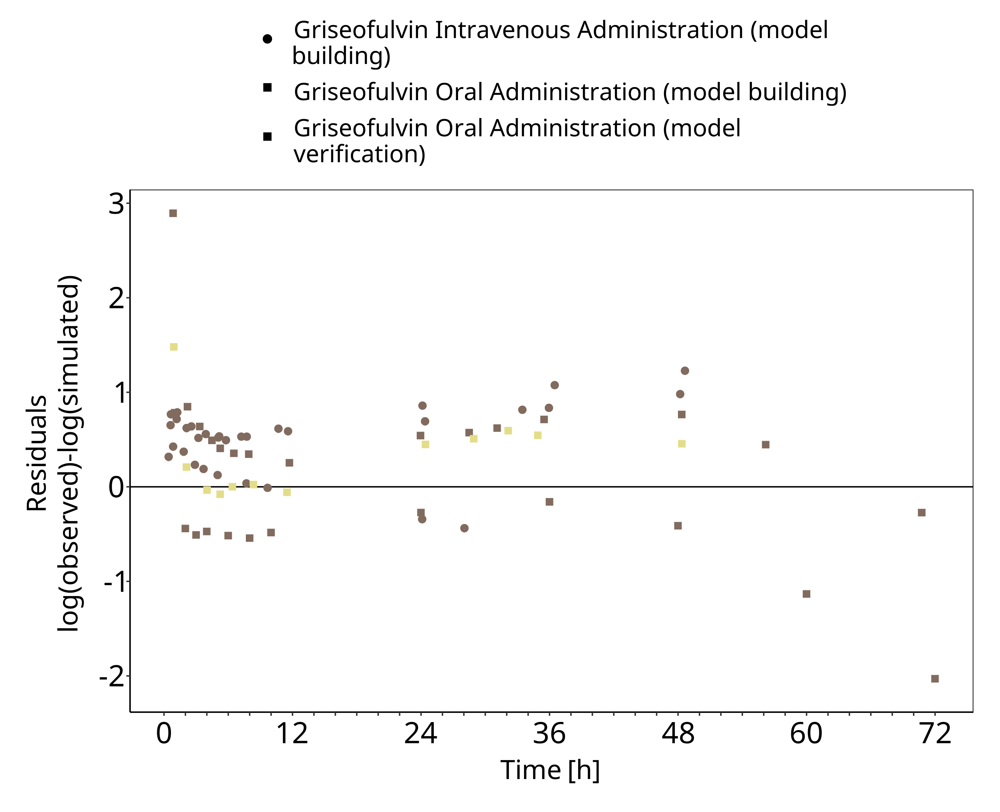
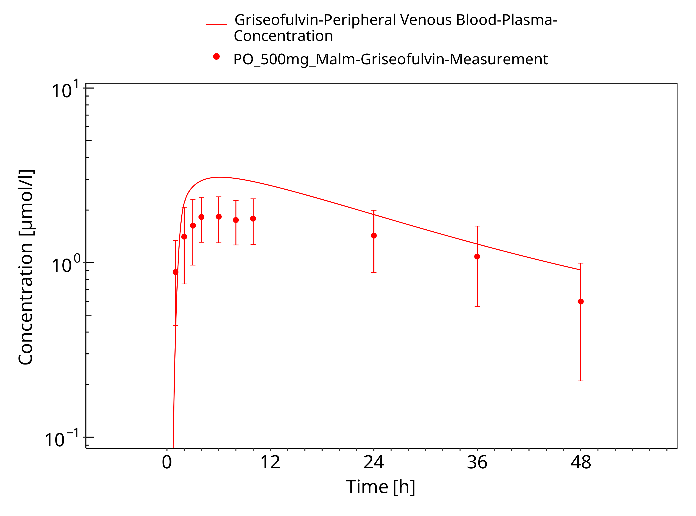
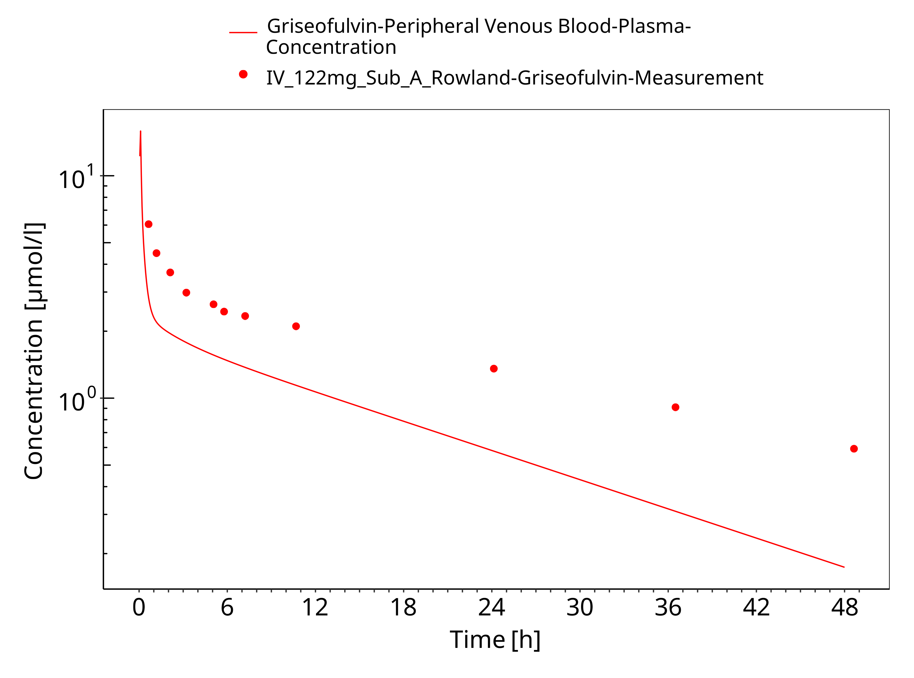
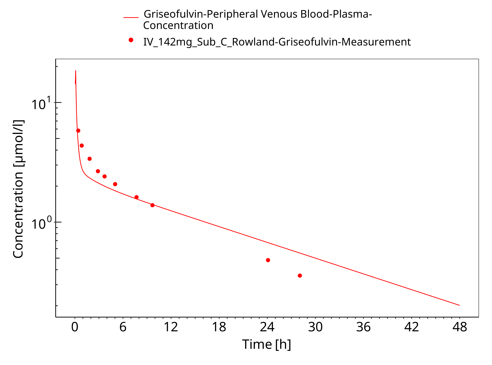
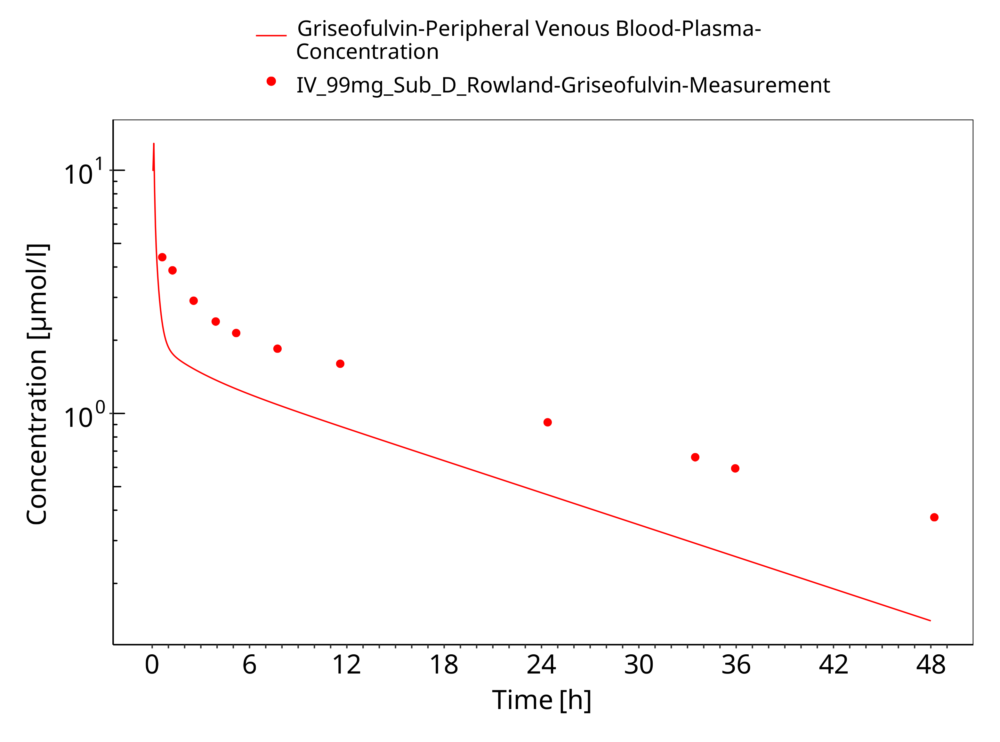
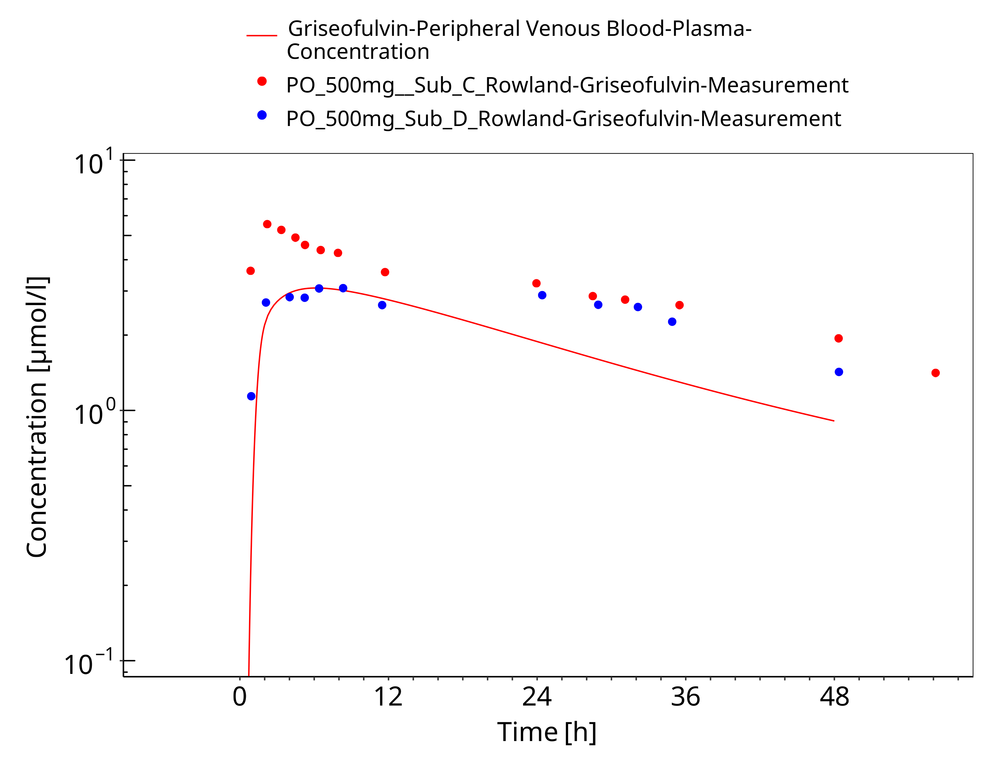

# Building and evaluation of a PBPK model for Griseofulvin in healthy adults

| Version                                         | x.x-OSPy.y                                                   |
| ----------------------------------------------- | ------------------------------------------------------------ |
| based on *Model Snapshot* and *Evaluation Plan* | https://github.com/Open-Systems-Pharmacology/Griseofulvin-Model/releases/tag/vx.x |
| OSP Version                                     | 11.3                                                          |
| Qualification Framework Version                 | 11.3                                                          |

This evaluation report and the corresponding PK-Sim project file are filed at:

https://github.com/Open-Systems-Pharmacology/OSP-PBPK-Model-Library/

# Table of Contents

 * [1 Introduction](#introduction)
 * [2 Methods](#methods)
   * [2.1 Modeling Strategy](#modeling-strategy)
   * [2.2 Data](#methods-data)
     * [2.2.1 In vitro / physico-chemical Data ](#invitro-and-physico-chemical-data)
     * [2.2.2 Clinical Data  ](#clinical-data)
       * [2.2.2.1 Model Building ](#model-building)
       * [2.2.2.2 Model Verification ](#model-verification)
   * [2.3 Model Parameters and Assumptions](#model-parameters-and-assumptions)
     * [2.3.1 Absorption ](#model-parameters-and-assumptions-absorption)
     * [2.3.2 Distribution ](#model-parameters-and-assumptions-distribution)
     * [2.3.3 Metabolism and Elimination ](#model-parameters-and-assumptions-metabolism-and-elimination)
     * [2.3.4 Automated Parameter Identification ](#model-parameters-and-assumptions-parameter-identification)
 * [3 Results and Discussion](#results-and-discussion)
   * [3.1 Final input parameters](#final-input-parameters)
   * [3.2 Diagnostics Plots](#diagnostics-plots)
   * [3.3 Concentration-Time Profiles](#ct-profiles)
 * [4 Conclusion](#conclusion)
 * [5 References](#main-references)

# 1 Introduction

The presented model building and evaluation report describes the development of a PBPK model for griseofulvin in healthy adults.

Griseofulvin is an orally administered antifungal agent used to treat skin and nail infections. 
It acts by disrupting microtubule function, thereby inhibiting fungal cell division. 
The compound selectively accumulates in keratin-producing tissues, providing localized antifungal activity.

Griseofulvin exhibits variable oral absorption, with bioavailability influenced by formulation and food intake. 
Peak plasma concentrations are typically observed within 4 to 8 hours. 
After absorption, the drug distributes broadly into skin, liver, fat, and muscle. 
It is extensively metabolized in the liver, with elimination occurring through both urine and feces. 
The terminal half-life ranges from 9 to 24 hours.

The presented Griseofulvin PBPK model as well as the respective evaluation plan and evaluation report are provided open-source ([https://github.com/Open-Systems-Pharmacology/Griseofulvin-Model](https://github.com/Open-Systems-Pharmacology/Griseofulvin-Model)).

# 2 Methods

## 2.1 Modeling Strategy

The general concept of building a PBPK model has previously been described by Kuepfer et al. ([Kuepfer 2016](#main-references)) Regarding the relevant anthropometric (height, weight) and physiological parameters (e.g. blood flows, organ volumes, binding protein concentrations, hematocrit, cardiac output) in adults was gathered from the literature and has been previously published ([PK-Sim Ontogeny Database Version 7.3](#main-references)). The information was incorporated into PK-Sim® and was used as default values for the simulations in adults.

The  applied activity and variability of plasma proteins and active processes that are integrated into PK-Sim® are described in the publicly available PK-Sim® Ontogeny Database Version 7.3 ([Schlender 2016](#main-references)) or otherwise referenced for the specific process.

First, a base mean model was built using clinical Phase I data including selected single dose studies with intravenous and oral applications (tablet) of Griseofulvin to find an appropriate structure to describe the pharmacokinetics in plasma. The mean PBPK model was developed using a typical European individual. 

Unknown parameters (see below) were identified using the Parameter Identification module provided in PK-Sim®. Structural model selection was mainly guided by visual inspection of the resulting description of data and biological plausibility.

Once the appropriate structural model was identified, additional parameters for tablet formulations were identified. 

The model was then verified by simulating:

- Oral administration of Griseofulvin in fasted then fed state

Details about input data (physicochemical, *in vitro* and clinical) can be found in  [Section 2.2](#methods-data).

Details about the structural model and its parameters can be found in  [Section 2.3](#model-parameters-and-assumptions).

## 2.2 Data

### 2.2.1 In vitro / physico-chemical Data 

A literature search was performed to collect available information on physicochemical properties of dapagliflozin. The obtained information from literature is summarized in the table below. 

| **Parameter**   | **Unit** | **Value** | Source                                     | **Description**                                 |
| :-------------- | -------- | --------- | ------------------------------------------ | ----------------------------------------------- |
| MW              | g/mol    |    352.8       | [PubChem 2025](#main-references)               | Molecular weight                                |
| pKa  |          |     2.18      | [Hansch 1995](#main-references)         | Acid dissociation constant                      |
| Solubility (pH) |      mg/l    |   8.82 (6.5)        | [Brinkmann-Trettenes 2014](#main-references)               | Aqueous Solubility   |

### 2.2.2 Clinical Data  

A literature search was performed to collect available clinical data on dapagliflozin in healthy adults.

#### 2.2.2.1 Model Building 

The following studies were used for model building (training data):

| **Dose [mg]** | **Dosing** | **PK data** |**Dataset**| **Reference** |
| --------------- | ------------------- | ----------------------- | ----------------- |----------------- |
| 99| iv |plasma|training|[Rowland 1968](#5-references)| 
| 122| iv |plasma|training|[Rowland 1968](#5-references)| 
| 142| iv |plasma|training|[Rowland 1968](#5-references)| 
| 500| po, tab, fasted then fed |plasma|training|[Rowland 1968](#5-references)| 

#### 2.2.2.2 Model Verification 

The following studies were used for model verification:

| **Dose [mg]** | **Dosing** | **PK data** |**Dataset**| **Reference** |
| --------------- | ------------------- | ----------------------- | ----------------- |----------------- |
| 500| po, tab, fasted then fed |plasma|verification|[Malm-Erjefält 2015](#5-references)| 

## 2.3 Model Parameters and Assumptions

### 2.3.1 Absorption 

The parameters values for `Intestinal permeability` and `Permeability P(intracellular->interstitial) Mucosa` were optimized based on clinical oral data, see [Section 2.3.4](#model-parameters-and-assumptions-identification), taking into account the fact that most of the absorption occurs in the duodenum. 
The measured solubility of Griseofulvin was taken from Product information from [Brinkmann-Trettenes 2014](#main-references) (see [Section 2.2.1](#invitro-and-physico-chemical-data)).

Tablet dissolution was modeled using an empirical Weibull dissolution approach, with the corresponding parameters estimated accordingly.

### 2.3.2 Distribution 

After testing the available organ-plasma partition coefficient and cell permeability calculation methods built in PK-Sim, observed clinical data was best described by choosing the partition coefficient calculation by `Poulin and Theil` and cellular permeability calculation by `Charge dependant Schmitt`. 

### 2.3.3 Metabolism and Elimination 

A general hepatic clearance was implemented and the value for `Plasma Clearance` was optimized using the training dataset. 

### 2.3.4 Automated Parameter Identification 

This is the result of the final parameter identification.

| Model Parameter      | Optimized Value | Unit |
| -------------------- | --------------- | ---- |
| `Fraction unbound` |          0.20       |      |
| `Plasma Clearance` |        1.3         |      |ml/min/kg
| `Intestinal permeability` |     3E-3            | cm/min     |
| `Weibul Dissolution time` |        60         |  min    |
| `Weibul Dissolution shape` |        4.00         |   -   |
| `Permeability P(intracellular->interstitial) Mucosa (Duodenum)` |        5.0E-3         |   cm/min   |
| `Permeability P(intracellular->interstitial) Mucosa (large intestine)`  |        2E-03         |   cm/min   |
| `Permeability P(intracellular->interstitial) Mucosa (small intestine)`  |        1E-04         |   cm/min   |

# 3 Results and Discussion

The PBPK model for Griseofulvin was developed and verified with clinical pharmacokinetic data.

The model was evaluated covering data from studies including in particular

* Intravenous Bolus
* Oral administration over fed and fasted states.

The model quantifies ...

The next sections show:

1. the final model parameters for the building blocks: [Section 3.1](#final-input-parameters).
2. the overall goodness of fit: [Section 3.2](#diagnostics-plots).
3. simulated vs. observed concentration-time profiles for the clinical studies used for model building and for model verification: [Section 3.3](#ct-profiles).

## 3.1 Final input parameters

The compound parameter values of the final PBPK model are illustrated below.

### Compound: Griseofulvin

#### Parameters

Name                                       | Value          | Value Origin | Alternative | Default
------------------------------------------ | -------------- | ------------:| ----------- | -------
Solubility at reference pH                 | 8.82 mg/l      |              | Measurement | True   
Reference pH                               | 6.5            |              | Measurement | True   
Solubility at reference pH                 | 14 mg/l        |              | table       | False  
Reference pH                               | 7.4            |              | table       | False  
Solubility table                           | 8.82 mg/l      |              | table2      | False  
Lipophilicity                              | 2.18 Log Units |              | Measurement | True   
Fraction unbound (plasma, reference value) | 0.2            |              | Measurement | True   
Is small molecule                          | Yes            |              |             |        
Molecular weight                           | 352.767 g/mol  |              |             |        
Plasma protein binding partner             | Albumin        |              |             |        

#### Calculation methods

Name                    | Value          
----------------------- | ---------------
Partition coefficients  | PK-Sim Standard
Cellular permeabilities | PK-Sim Standard

#### Processes

##### Systemic Process: Total Hepatic Clearance-Hepatic_Clearance

Species: Human

###### Parameters

Name                          | Value          | Value Origin                                                                                                         
----------------------------- | -------------- | ---------------------------------------------------------------------------------------------------------------------
Fraction unbound (experiment) | 0.2            | Parameter Identification-Parameter Identification-Value updated from 'Parameter Identification 2' on 2025-04-10 14:24
Lipophilicity (experiment)    | 2.18 Log Units | Parameter Identification-Parameter Identification-Value updated from 'Parameter Identification 2' on 2025-04-10 14:24
Plasma clearance              | 1.3 ml/min/kg  | Parameter Identification-Parameter Identification-Value updated from 'Parameter Identification 1' on 2025-05-16 17:57

## 3.2 Diagnostics Plots

Below you find the goodness-of-fit visual diagnostic plots for the PBPK model performance of all data used presented in [Section 2.2.2](#clinical-data).

The first plot shows observed versus simulated plasma concentration, the second weighted residuals versus time. 

**Table 3-1: GMFE for Goodness of fit plot for concentration in plasma**

|Group                                                    |GMFE |
|:--------------------------------------------------------|:----|
|Griseofulvin Intravenous Administration (model building) |1.76 |
|Griseofulvin Oral Administration (model building)        |1.72 |
|Griseofulvin Oral Administration (model verification)    |1.91 |
|All                                                      |1.77 |

 
 

**Figure 3-1: Goodness of fit plot for concentration in plasma**

 
 

**Figure 3-2: Goodness of fit plot for concentration in plasma**

 
 

## 3.3 Concentration-Time Profiles

Simulated versus observed concentration-time profiles of all data listed in [Section 2.2.2](#clinical-data) are presented below.

**Figure 3-3: Time Profile Analysis**

 
 

**Figure 3-4: Time Profile Analysis**

 
 

**Figure 3-5: Time Profile Analysis**

 
 

**Figure 3-6: Time Profile Analysis**

 
 

**Figure 3-7: Time Profile Analysis**

 
 

# 4 Conclusion

The herein presented PBPK model adequately describes the pharmacokinetics of Griseofulvin in adults.
A high variability in the pharmacokinetics of oral Griseofulvin was observed between patients in the clinical studies, making it difficult to find parameters that would fit well each subject. 
Such a variability needs to be taken into account for the simulation of the pharmacokinetics of Griseofulvin in patients.

# 5 References

**Kuepfer 2016** Kuepfer L, Niederalt C, Wendl T, Schlender JF, Willmann S, Lippert J, Block M, Eissing T, Teutonico D. Applied Concepts in PBPK Modeling: How to Build a PBPK/PD Model.CPT Pharmacometrics Syst Pharmacol. 2016 Oct;5(10):516-531. doi: 10.1002/psp4.12134. Epub 2016 Oct 19. 	

**PK-Sim Ontogeny Database Version 7.3** ([https://github.com/Open-Systems-Pharmacology/OSPSuite.Documentation/blob/38cf71b384cfc25cfa0ce4d2f3addfd32757e13b/PK-Sim%20Ontogeny%20Database%20Version%207.3.pdf](https://github.com/Open-Systems-Pharmacology/OSPSuite.Documentation/blob/38cf71b384cfc25cfa0ce4d2f3addfd32757e13b/PK-Sim%20Ontogeny%20Database%20Version%207.3.pdf))	

**Schlender 2016** Schlender JF, Meyer M, Thelen K, Krauss M, Willmann S, Eissing T, Jaehde U. Development of a Whole-Body Physiologically Based Pharmacokinetic Approach to Assess the Pharmacokinetics of Drugs in Elderly Individuals. Clin Pharmacokinet. 2016 Dec;55(12):1573-1589. 	

**PubChem 2025** PubChem Compound Summary of Griseofulvin (2025). https://pubchem.ncbi.nlm.nih.gov/compound/Griseofulvin

**Hansch 1995** Hansch C, Hoekman D, Leo A, Zhang L, Li P. The expanding role of quantitative structure-activity relationships (QSAR) in toxicology. Toxicol Lett. 1995 Sep;79(1-3):45-53. doi: 10.1016/0378-4274(95)03356-p. PMID: 7570673.

**Brinkmann-Trettenes 2014** Brinkmann-Trettenes U, Bauer-Brandl A. Solid phospholipid nano-particles: investigations into formulation and dissolution properties of griseofulvin. Int J Pharm. 2014 Jun 5;467(1-2):42-7. doi: 10.1016/j.ijpharm.2014.03.023. Epub 2014 Mar 11. PMID: 24614583.

**Rowland 1968** Rowland M, Riegelman S, Epstein WL. Absorption kinetics of griseofulvin in man. J Pharm Sci. 1968 Jun;57(6):984-9. doi: 10.1002/jps.2600570613. PMID: 5671346.

**Malm-Erjefält 2015** Malm-Erjefält M, Ekblom M, Vouis J, Zdravkovic M, Lennernäs H. Effect on the Gastrointestinal Absorption of Drugs from Different Classes in the Biopharmaceutics Classification System, When Treating with Liraglutide. Mol Pharm. 2015 Nov 2;12(11):4166-73. doi: 10.1021/acs.molpharmaceut.5b00278. Epub 2015 Oct 12. PMID: 26426736.

